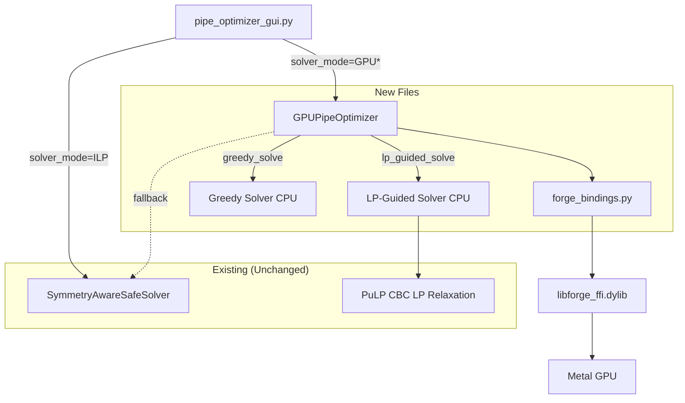

# Design: gpu-pipe-optimizer

## Overview

Add two new Python modules (`forge_bindings.py`, `gpu_solver.py`), one test file (`test_gpu_solver.py`), and modify the GUI (`pipe_optimizer_gui.py`). The GPU path parallelizes pattern generation on Metal GPU via forge-ffi custom kernels, then solves with a CPU greedy or LP-guided algorithm. The existing ILP path remains unchanged as fallback.

## Architecture



## Components

### Component A: `forge_bindings.py` -- Python ctypes wrapper

**Purpose**: Thin RAII wrapper around libforge_ffi.dylib C-ABI.

**Classes**:

```python
class ForgeError(Exception):
    """Raised on forge-ffi errors. Includes error code and message."""
    pass

class ForgeContext:
    """Wraps forge_ctx_t*. Creates Metal device + command queue."""
    def __init__(self) -> None  # calls forge_context_create()
    def __del__(self) -> None   # calls forge_context_destroy()
    def __enter__ / __exit__    # context manager support

class ForgeBuffer:
    """Wraps forge_buf_t*. Zero-copy UMA shared memory."""
    @classmethod
    def from_numpy(cls, ctx: ForgeContext, arr: np.ndarray) -> ForgeBuffer
    @classmethod
    def alloc(cls, ctx: ForgeContext, count: int, dtype: ForgeDtype) -> ForgeBuffer
    def to_numpy(self) -> np.ndarray  # zero-copy view via ctypes
    def __len__(self) -> int
    def __del__(self) -> None  # calls forge_buffer_destroy()

class ForgeKernel:
    """Wraps forge_kernel_t*. Compiled Metal kernel handle."""
    def __init__(self, ctx: ForgeContext, msl_source: str, fn_name: str)
    def __del__(self) -> None  # calls forge_kernel_destroy()

class ForgePipeline:
    """Wraps forge_pipeline_t*. Queues and executes GPU operations."""
    def __init__(self, ctx: ForgeContext)
    def dispatch_1d(self, kernel: ForgeKernel, buffers: list[ForgeBuffer], thread_count: int) -> None
    def execute(self) -> float  # returns gpu_time_ms
```

**Dylib Resolution Order**:
1. `./libforge_ffi.dylib` (working directory)
2. `~/gpu_kernel/metal-forge-compute/target/release/libforge_ffi.dylib`
3. `sys._MEIPASS / libforge_ffi.dylib` (PyInstaller bundle)
4. `DYLD_LIBRARY_PATH` paths
5. Raise `ForgeError("libforge_ffi.dylib not found")`

**ForgeDtype Mapping**:

| Python/numpy | ForgeDtype | Value |
|-------------|-----------|-------|
| `np.float32` | `FORGE_DTYPE_F32` | 2 |
| `np.uint32` | `FORGE_DTYPE_U32` | 0 |
| `np.int32` | `FORGE_DTYPE_I32` | 1 |

### Component B: `gpu_solver.py` -- GPU pattern generation + solvers

**Purpose**: Metal kernel-based pattern generation and CPU greedy/LP-guided solving.

**Responsibilities**:
- Compile and dispatch Metal kernels for 2-pipe and 3-pipe pattern generation
- Greedy solver: sort patterns by waste, single-pass inventory assignment
- LP-guided solver: LP relaxation + floor + greedy mop-up
- `GPUPipeOptimizer` class with same interface as `SymmetryAwareSafeSolver`

### Component C: GUI integration (modifications to `pipe_optimizer_gui.py`)

**Purpose**: Add solver mode selection and route worker thread to appropriate solver.

**Responsibilities**:
- Add "Solver mode" combobox in Advanced Parameters (row 5, shift tip to row 6)
- Read solver_mode in `run_optimizer()` params dict
- Route `_optimizer_worker()` to GPU or ILP solver based on mode
- Display solver mode in results summary

## Data Flow

### GPU Pattern Generation Flow

1. **Input**: `unique_lengths[]` (float32 array, n elements), `target_length`, `max_waste`, `inventory[]`
2. **Upload to GPU**: `ForgeBuffer.from_numpy(ctx, lengths_f32)` -- zero-copy
3. **Compile kernels**: `ForgeKernel(ctx, GEN_PATTERNS_3_MSL, "gen_patterns_3")`
4. **Allocate output buffers**: `ForgeBuffer.alloc(ctx, MAX_PATTERNS * 3, U32)` for indices, `ForgeBuffer.alloc(ctx, MAX_PATTERNS, F32)` for waste, `ForgeBuffer.alloc(ctx, 1, U32)` for atomic counter
5. **Dispatch**: `pipeline.dispatch_1d(kernel, [lengths, params, out_indices, out_waste, counter], n*n*n)`
6. **Execute**: `pipeline.execute()` -- blocks until GPU completes
7. **Read results**: `counter.to_numpy()[0]` gives valid pattern count, slice output arrays to that count
8. **Convert to Python**: Build pattern tuples matching ILP format

### Greedy Solve Flow

1. **Input**: List of pattern tuples, inventory dict
2. **Sort**: `np.argsort(waste_array)` -- ascending waste (best patterns first)
3. **Single-pass**: For each pattern (by sorted order):
   - `max_uses = min(remaining_inventory[idx] // count for idx, count in pattern.counts)`
   - Assign `max_uses` copies, subtract from inventory
4. **Output**: Solution list matching ILP format

### LP-Guided Solve Flow

1. **Input**: List of pattern tuples, inventory dict
2. **LP Relaxation**: Build PuLP model with continuous (not integer) variables, solve
3. **Floor**: Take `floor(x_i.value)` for each pattern variable
4. **Subtract**: Remove floored assignments from inventory
5. **Greedy mop-up**: Run greedy solver on remaining inventory with remaining patterns
6. **Output**: Combined solution list

## Technical Decisions

| Decision | Options | Choice | Rationale |
|----------|---------|--------|-----------|
| Kernel params | Struct buffer vs scalar buffers | Single params buffer (float32 array) | forge-ffi `dispatch_1d` only binds buffer pointers. Pack `[n, target, max_waste]` into one float32 buffer. |
| Output format | Flat arrays vs struct buffer | 3 parallel arrays (i_buf, j_buf, k_buf) + waste_buf + counter_buf | Simpler kernel, easy numpy conversion |
| Atomic counter | Per-threadgroup vs global | Global atomic `atomic_uint` | Single counter sufficient for <4M patterns. No contention bottleneck at this scale. |
| Inventory check in kernel | GPU vs CPU post-filter | GPU-side check | Eliminates invalid patterns before CPU transfer. Reduces output by ~30-50%. |
| LP solver | scipy.linprog vs PuLP | PuLP (already installed) | Consistent with existing codebase, LP relaxation is just `cat='Continuous'` instead of `cat='Integer'`. |
| Greedy sort key | Waste ascending vs pattern length descending | Waste ascending | Minimizes wasted material, directly optimizes for pile count. |

## File Structure

| File | Action | Purpose |
|------|--------|---------|
| `forge_bindings.py` | **Create** | ctypes wrapper for libforge_ffi.dylib |
| `gpu_solver.py` | **Create** | GPU pattern gen + greedy/LP solvers + GPUPipeOptimizer class |
| `test_gpu_solver.py` | **Create** | 6 validation tests |
| `pipe_optimizer_gui.py` | **Modify** | Add solver mode dropdown + worker routing |
| `pipe_optimizer_v5_safe.py` | **No change** | Existing ILP solver (fallback + baseline) |

## Metal Kernel Design

### `gen_patterns_3` kernel (3-pipe combinations)

```metal
#include <metal_stdlib>
using namespace metal;

kernel void gen_patterns_3(
    device const float* lengths [[buffer(0)]],   // unique_lengths[n]
    device const float* params  [[buffer(1)]],   // [n, target, max_waste, inv_0, inv_1, ...]
    device uint*  out_i         [[buffer(2)]],   // output: index i per pattern
    device uint*  out_j         [[buffer(3)]],   // output: index j per pattern
    device uint*  out_k         [[buffer(4)]],   // output: index k per pattern
    device float* out_waste     [[buffer(5)]],   // output: waste per pattern
    device atomic_uint* counter [[buffer(6)]],   // atomic output index
    uint tid [[thread_position_in_grid]])
{
    uint n = uint(params[0]);
    float target = params[1];
    float max_waste = params[2];
    // params[3..3+n] = inventory counts per type

    // Decode flat tid to (i, j, k)
    uint i = tid / (n * n);
    uint j = (tid / n) % n;
    uint k = tid % n;

    // Upper triangle only: i <= j <= k
    if (i > j || j > k) return;
    // Bounds check
    if (i >= n || j >= n || k >= n) return;

    float sum = lengths[i] + lengths[j] + lengths[k];
    float waste = sum - target;

    // Range check
    if (waste < 0.0f || waste > max_waste) return;

    // Inventory feasibility (4 cases)
    float inv_i = params[3 + i];
    float inv_j = params[3 + j];
    float inv_k = params[3 + k];

    if (i == j && j == k) {
        if (inv_i < 3.0f) return;
    } else if (i == j) {
        if (inv_i < 2.0f || inv_k < 1.0f) return;
    } else if (j == k) {
        if (inv_i < 1.0f || inv_j < 2.0f) return;
    } else {
        if (inv_i < 1.0f || inv_j < 1.0f || inv_k < 1.0f) return;
    }

    // Atomically claim output slot
    uint idx = atomic_fetch_add_explicit(counter, 1, memory_order_relaxed);
    out_i[idx] = i;
    out_j[idx] = j;
    out_k[idx] = k;
    out_waste[idx] = waste;
}
```

### `gen_patterns_2` kernel (2-pipe combinations)

Same structure with n^2 threads, `(i, j)` decode, `i <= j` constraint. Simpler inventory check (2 cases: `i == j` needs 2, else needs 1 each).

### Params Buffer Layout

```
params[0]     = n (number of unique length types, cast to float)
params[1]     = target_length
params[2]     = max_waste
params[3]     = inventory[0] (count of type 0)
params[4]     = inventory[1]
...
params[3+n-1] = inventory[n-1]
```

Total params buffer size: `3 + n` float32 elements (for n=273: 276 floats = 1104 bytes).

## GPUPipeOptimizer Class Design

```python
class GPUPipeOptimizer:
    """GPU-accelerated pipe optimizer. Same interface as SymmetryAwareSafeSolver."""

    def __init__(self, pipe_lengths, target_length=100.0, max_waste=20.0, precision=1):
        # Symmetry reduction (identical to v5)
        self.raw_lengths = pipe_lengths
        self.inventory = Counter(rounded)
        self.unique_lengths = sorted(...)
        self.n_types = len(self.unique_lengths)
        self.theoretical_max = int(sum(pipe_lengths) // target_length)

        # GPU init (may fail -- sets self.gpu_available = False)
        try:
            self.ctx = ForgeContext()
            self.gpu_available = True
        except ForgeError:
            self.gpu_available = False

    def generate_patterns(self, max_welds=3, stop_event=None):
        """Generate patterns via GPU (or CPU fallback)."""
        if self.gpu_available:
            return self._generate_patterns_gpu(max_welds, stop_event)
        else:
            return self._generate_patterns_cpu(max_welds, stop_event)

    def solve_greedy(self, patterns):
        """Greedy solve: sort by waste, single-pass assignment."""
        # Returns (solution, 'GREEDY', solve_time)

    def solve_lp_guided(self, patterns):
        """LP relaxation + floor + greedy mop-up."""
        # Returns (solution, 'LP_GUIDED', solve_time)
```

**Key**: `GPUPipeOptimizer` exposes `raw_lengths`, `unique_lengths`, `precision`, `theoretical_max`, `n_types`, `inventory` -- all attributes used by `export_to_excel()`.

## GUI Integration Design

### Solver Mode Dropdown (in `adv_frame`)

```python
# Row 5: Solver mode (new)
ttk.Label(adv_frame, text="Solver mode:").grid(row=5, column=0, sticky='w', padx=5)
self.solver_var = tk.StringVar(value="ILP (Optimal)")
solver_combo = ttk.Combobox(adv_frame, textvariable=self.solver_var, width=25, state='readonly')
solver_combo['values'] = ('ILP (Optimal)', 'GPU Greedy (Fast)', 'GPU + LP Rounding (Balanced)')
solver_combo.grid(row=5, column=1, sticky='w', padx=5, pady=2)
ttk.Label(adv_frame, text="ILP=exact, GPU Greedy=fast, LP Rounding=balanced",
          foreground='gray', font=('Helvetica', 9)).grid(row=5, column=2, sticky='w', padx=5)

# Row 6: Tip (shifted from row 5)
tip.grid(row=6, ...)
```

### Worker Thread Routing

```python
def _optimizer_worker(self, params):
    solver_mode = params['solver_mode']

    if solver_mode == 'ILP (Optimal)':
        # Existing ILP path (unchanged)
        ...
    else:
        # GPU path
        try:
            from gpu_solver import GPUPipeOptimizer
            gpu_solver = GPUPipeOptimizer(pipe_data.lengths, target, waste, precision)
            patterns = gpu_solver.generate_patterns(max_welds=max_welds, stop_event=self.stop_event)

            if solver_mode == 'GPU Greedy (Fast)':
                solution, status, solve_time = gpu_solver.solve_greedy(patterns)
            else:
                solution, status, solve_time = gpu_solver.solve_lp_guided(patterns)

            # Use gpu_solver as solver for export (has same attributes)
            solver = gpu_solver

        except Exception as e:
            # Fallback to ILP
            self.progress_queue.put(("status", f"GPU unavailable ({e}), falling back to ILP..."))
            # ... run ILP path ...
```

## Error Handling

| Error | Handling | User Impact |
|-------|----------|-------------|
| `libforge_ffi.dylib` not found | `ForgeError` raised, caught in `GPUPipeOptimizer.__init__`, sets `gpu_available=False` | Pattern gen falls back to CPU loops. No user action needed. |
| Metal kernel compile failure | `ForgeError` raised, caught in `generate_patterns`, falls back to CPU | Transparent fallback. Warning logged. |
| GPU out-of-memory | Pipeline execute fails, caught, falls back to CPU | Transparent fallback. |
| Atomic counter overflow | Pre-allocate 4M output slots (well above worst case ~1M) | Should not occur. |
| LP relaxation infeasible | PuLP returns non-optimal status, fall back to greedy-only | Slightly lower quality but still functional. |
| Invalid solver_mode in GUI | Default to ILP path | No impact -- combobox is readonly. |

## Existing Patterns to Follow

- **RAII with `__del__`**: Follow `MemoryMonitor` pattern from `pipe_optimizer_v5_safe.py` for resource cleanup
- **Progress queue**: Follow `pipe_optimizer_gui.py:386-498` pattern for worker thread communication
- **Counter-based symmetry**: Follow `pipe_optimizer_v5_safe.py:325-360` for inventory/unique_lengths setup
- **Solution dict format**: Follow `pipe_optimizer_v5_safe.py:597-615` exactly for `export_to_excel()` compatibility
- **Thread-safe params**: Follow GUI pattern of reading all tkinter vars in main thread before spawning worker (line 370-380)
